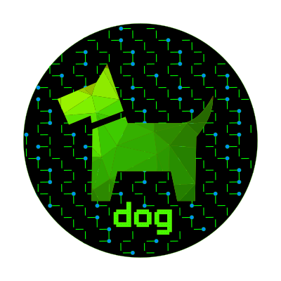
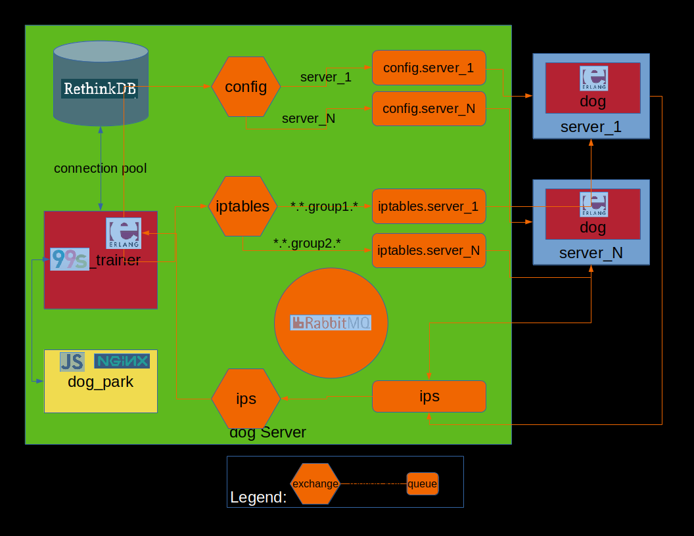

  

1. [What is dog?](#what-is-dog)
1. [Why dog?](#why-dog)
1. [Features](#features)
1. [Components](#components)
1. [Architecture](#architecture)
1. [Security](#security)
1. [Quick Install](#quick-install)
1. [Install](#install)
1. [Use](#use)
1. [Road Map](#road-map)

## What is dog?

dog is a distributed firewall management system designed to manage hundreds+ of
per-server firewalls.  Currently iptables on Linux supported, but others could
be added.

dog is your network guard dog.

'dog-fw' is the search friendly name for dog.

## Why dog?

- Need consistent network access rules across hundreds+ of servers in multiple
  regions on multiple providers?
- Need defense-in-depth, beyond gateway firewalls?
- Need blocklists with thousands of addresses distributed across many servers
  updated constantly?
- Need to limit number of connections and/or bandwidth usage?
- Sick of error-prone manual updates of per-server iptables rules?

## Features

- Centrally manage hundreds+ of per-server iptables firewalls.  
- Works across clouds, regions, and on-premise infrastructure.
- Adapts to dynamic address changes.
- Large blocklists/allowlists can be used and will be updated across
  all servers in seconds.
- Rules scale to tens of thousands of addresses (using [ipsets](https://ipset.netfilter.org)).
- Alerts if servers fail to communicate or if their firewalls are modified
  outside of dog control.
- Reactive web interface.
- API for external integrations.
- Tested in production with hundreds of servers.
- Multiple dog_trainers can be federated together to allow sharing of addresses,
  while allowing each dog_trainer to have its own security rules.
- Integration with [Flan Scan](https://github.com/cloudflare/flan),
  a network vulnerability scanner.
- Agents support Linux 2.6+ iptables firewalls.
- Supports cloud public IP addresses (currently only EC2).
- Manages cloud security groups across multiple regions (EC2).
- Compatible with Docker, LXD localhost firewall rules.
- [Terraform Provider](https://github.com/relaypro-open/terraform-provider-dog): Can be managed as code with a Terraform provider.
- [Ansible Plugins](https://github.com/relaypro-open/community.dog): Can be used as a dynamic inventory source and/or as a connector, replaceing ssh.

## Components

- [dog_trainer](https://github.com/relaypro-open/dog_trainer) is a central server,
   used to configure and control dog agents.  
   Multiple dog_trainers can be federated together to allow sharing of agents' addresses,
   while allowing each dog_trainer to have its own security rules.

- [dog agent](https://github.com/relaypro-open/dog_agent)s are deployed to all managed
   servers.  dog agents control the server's iptables firewalls.

- [dog_park](https://github.com/relaypro-open/dog_park) is the
   browser user interface for dog_trainer.

## Architecture

- dog Agents communicate with dog_trainer over RabbitMQ queues.
- dog_trainer stores its configuration in a RethinkDB database.
- dog_park communicates with dog_trainer via a RESTful API, which can be used for
  further integrations.

## Security

- Provides defense-in-depth, so you are not completely dependent on gateway firewalls.
- dog agents authenticate to RabbitMQ with per-agent client certificates, and all
  communication is encrypted.
- RabbitMQ should be configured to only communicate over private networks.
- Additional federated RabbitMQs can be configured to allow communication over
  regional boundaries.
- dog_trainer stores hashes of the iptables and ipsets it sends to agents.  Agents
  send their own generated hashes to dog_trainer via a scheduled check-in.
- dog_trainer will alert if agents fail to communicate over time or if the hashes
  the agents provide do not match what dog_trainer expects.
- dog's use of ipsets not only allows highly scalable, fast rulesets, it also
  keeps iptables size small enough to be auditable by a human.

## Quick Install

A working dog environment on containers in a local VM

- [dog_on_a_dock](docs/install/dog_on_a_dock.md)

## Install

- [dog_trainer](docs/install/dog_trainer.md)
- [dog_park](docs/install/dog_park.md)
- [dog_agent](docs/install/dog_agent.md)

## Use

- [user_manual](docs/user_manual/user_manual.md)

## Road Map

- Manage Cloud security groups
    - [x] AWS EC2
    - [ ] Google Cloud
    - [ ] Microsoft Azure
- Support Cloud Instances
    - [x] AWS EC2
    - [ ] Google Cloud
    - [ ] Microsoft Azure
- Agent support for
    - More Linux distros
        - [ ] Arch
    - Other \*nix OSes
        - [ ] BSD
- Support for other firewall types
    - [ ] nftables (beyond the current iptables-legacy compatibility support)
