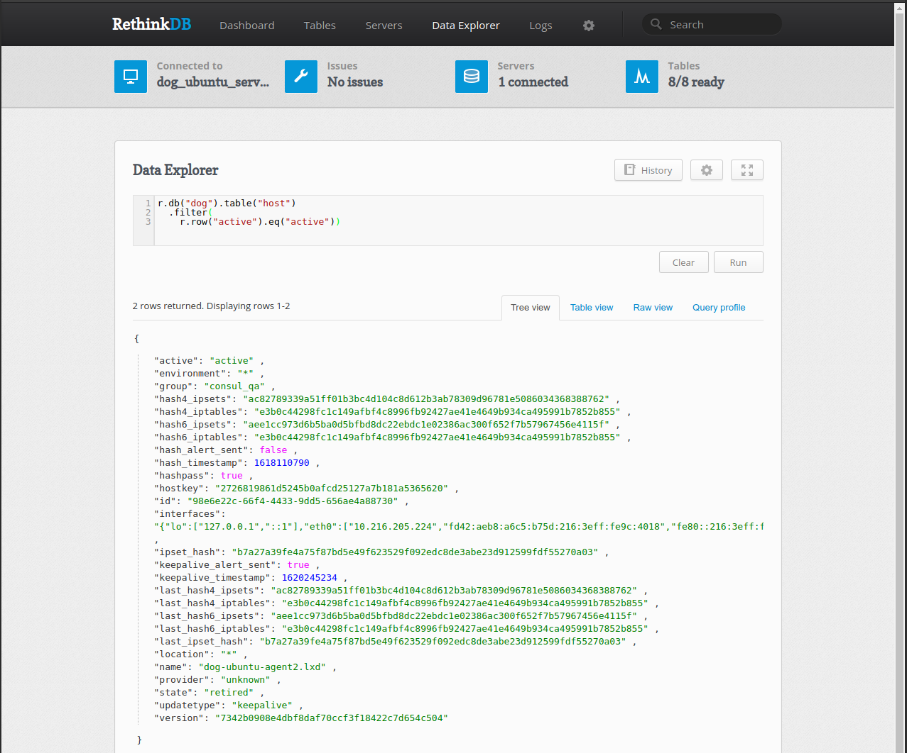
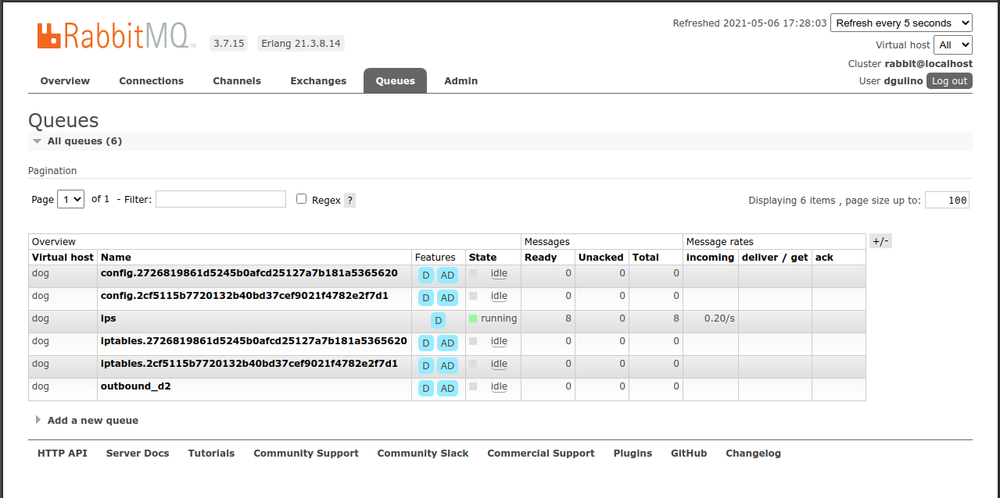

<p align="center">
  
</p>

# dog_trainer

dog_trainer is the central control server of dog.

Components:
- [dog_trainer](#dog_trainer) the Erlang application.
- [RethinkDB](#rethinkdb), a NoSQL database that store's dog's state.
- [RabbitMQ](#rabbitmq). All communication between dog_trainers and dog_agents goes through RabbitMQ queues.

# dog_trainer

dog_trainer is deployed as an Erlang release, which is a way to combine the application and all of the Erlang language
components needed.

- Start: `sudo systemctl start dog_trainer`

- Stop: `sudo systemctl stop dog_trainer`

- Log location: `/var/log/dog_trainer`

- Temp file location: `/tmp/dog_trainer`

- Useful shell commands [Commands](dog_trainer-shell.md)

- Configuration is stored in a file called sys.config, which is located in /opt/dog_trainer/releases/$VERSION/ 

  example sys.config annotated:

```bash
      [
    {dog_trainer, [
        {env, "q1"}, # name of this dog_trainer's environment, limited to two characters.  needs to be unique between any linked dog_trainers.
        {version, "20180423-180410-relflow"}, 
        {smtp_relay,"smtp.sendgrid.net"}, # email configuration for alerts
        {smtp_username, "" },
        {smtp_password, "" },
        {smtp_to, [""]}, # list of email recipients.
        {smtp_from,""},
        {polling_interval_seconds,60}, # how often 
        {keepalive_alert_seconds,1800}, # time a dog_agent can not communicate before being considered 'inactive'.
        {rethinkdb_host, "dog-db-qa.nocell.io"}, # rethinkdb config
        {rethinkdb_port, 28015},
        {smtp_password, "" },
        {rethinkdb_username, "" },
        {rethinkdb_password, "" },
        {rethink_timeout_ms, 10000},
        {rethink_squash_sec, 1.0}, # how many seconds to combine rethink streams before applying them.
        {profile_periodic_publish_interval_seconds, 5},  # how often to publish iptables updates, if they are queued.
        {ipset_periodic_publish_interval_seconds, 5}, # how often to publish global ipsets, if an update is queued.
        {check_v6_hashes, true}, # whether dog_agent IPv6 ipset hashes are checked by dog_trainer.
        {generate_unset_tables, false}, # whether to generate and publish naive (one IP per line) iptables in addition to iptables that use ipsets.
        {max_interval_since_last_agent_update,2}, # how many intervals to wait when no dog_agent updates are received before dog_trainer stops applying updates.
                                                  # this is done to ensure a dog_trainer that is having a network will not set all hosts as inactive or retired.
        {pools, [ # rethinkdb db pool configuration.
            {pool1, [
                {size, 10},
                {max_overflow, 20}
            ], []}
        ]}
    ]},
    {sync, [
        {growl, none},
        {log, [warnings, errors]},
        {non_descendants, fix},
        {executable, auto},
        {whitelisted_modules, []},
        {excluded_modules, []}
    ]},
    {lager, [
        {handlers, [
            {lager_file_backend, [{file, "/var/log/dog_trainer/error.log"}, {level, error}, {size, 104857600}]},
            {lager_file_backend, [{file, "/var/log/dog_trainer/console.log"}, {level, info}, {size, 104857600}]}
        ]},
        {crash_log, "/var/log/dog_trainer/crash.log"},
        {tracefiles, [
        	    ]},
        {async_threshold, 10000},
        {sieve_threshold, 5000},
        {sieve_window, 100}
    ]},
    {thumper, [ # thumper is the rabbitmq client library.  certificates should always be used.
        {substitution_rules, [{cluster, {edb, get_cluster_id, []}}]},
        {thumper_svrs, [default, publish]},
        {brokers, [
            {default, [
                {rabbitmq_config,
                    [
                        {host, "localhost"},
                        {port, 5673},
                        {api_port, 15672},
                        {virtual_host, <<"dog">>},
                        {user, "" },
                        {password, "" },
                        {ssl_options, [{cacertfile, "/var/consul/data/pki/certs/ca.crt"},
                                       {certfile, "/var/consul/data/pki/certs/server.crt"},
                                       {keyfile, "/var/consul/data/pki/private/server.key"},
                                       {verify, verify_peer},
                                       {server_name_indication, disable},
                                       {fail_if_no_peer_cert, true}
                                      ]},
                         {broker_config,
                             {thumper_tx,
                                 ["/opt/dog_trainer/priv/broker.tx"]}}
                    ]}]},
            {publish, [{rabbitmq_config, default}]}
        ]},
        {queuejournal, # local rabbitmq queueing
            [
                {enabled, true},
                {dir, "/var/db/dog_trainer/queuejournal"},
                {memqueue_max, 10000},
                {check_journal, true}
            ]
        }
    ]}
].
```

- Erlang console: `/opt/dog/dog_trainer remote_console`

    Useful commands:
    - [observer_cli](https://github.com/zhongwencool/observer_cli):start()

# rethinkdb

RethinkDB is a NoSQL database used to store dog_trainer's state.\

dog_trainer not only queries and updates the db, it also extensively uses RethinkDB's streams to trigger events.\

You can use the RethinkDB data explorer to query the database.

Useful DB queries: [DB Queries](dog_trainer-common_reql.md)



- console: http://$HOSTNAME:8080/

# rabbitmq

RabbitMQ is a message queue server.  All communication between dog_trainers and dog_agets goes through RabbitMQ.
This provides an easy way to monitor the communication status of each component.\

Each dog_agent creates one iptables.$HOSTKEY that it ingests data from dog_trainer.\

Each dog_agent also creates one config.$HOSTKEKEY\



One can disconnect an agent, forcing it to reconnect.  This can fix dog_agent connectivity issues.

- console: http://$HOSTNAME:15672/
