

  

- [Hosts](#hosts) are servers with Agents installed.
- [Groups](#groups) are collections of Hosts.
- [Zones](#zones) are lists of addresses.
- [Profiles](#profiles) are lists of Rules, and are assigned to Groups.
- Rules can include either Groups or Zones along with Services that describe the
  controlled protocols.
- Iptables are generated from these Rules and distributed to Agents.
- Ipsets are used to make fast, readable iptables rules even with thousands of addresses.
- [Services](#services) define ports and protocols.
- [Flan Scans](#flan-scans) show network vulnerabilities found on servers.
- [Links](#external-links) are used to share the addresses of Groups and Zones (as ipsets) between
  multiple dog_trainers.

- Configuration and runtime guides:
    - [dog_trainer](dog_trainer.md)
    - [dog_agent](dog_agent.md)

# Web Console: dog_park

dog_park is the primary user interface for dog.

## Hosts

Each agent is listed in Hosts.  Agents appear as Hosts as they attach to dog_trainer.
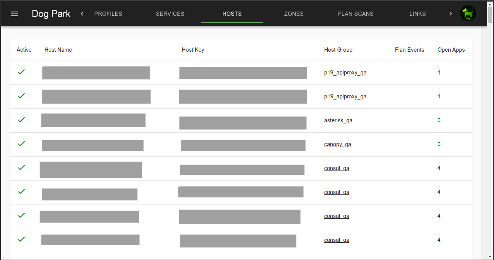

Hosts include local, public and ec2 public addresses.

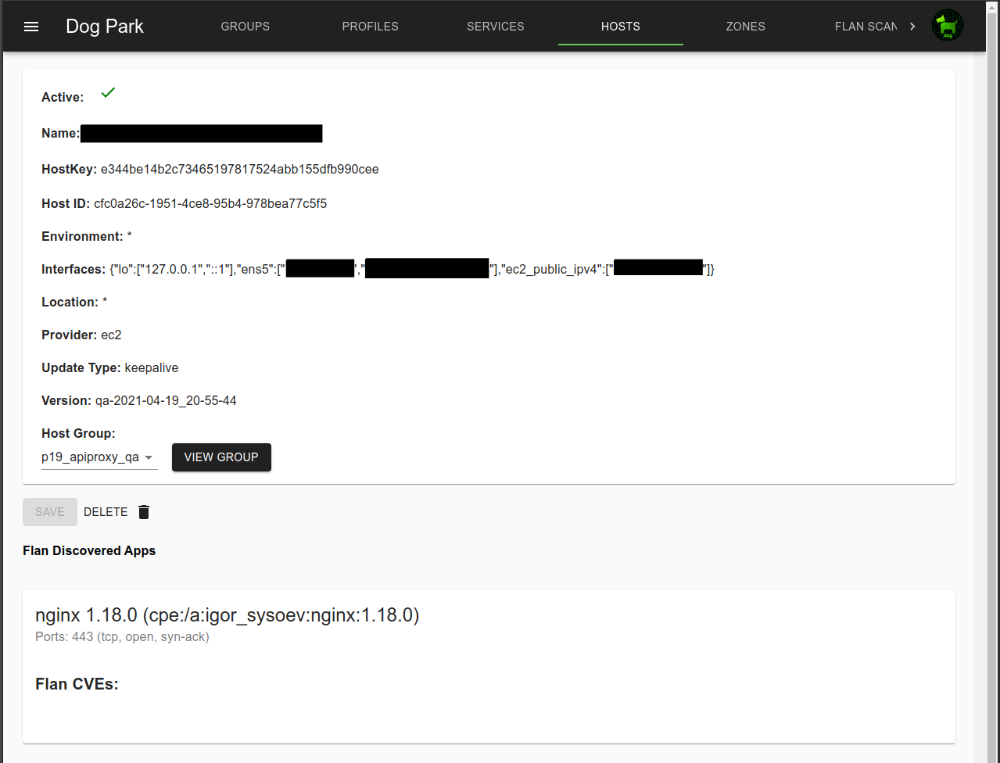

## Groups

Hosts are assigned to a group, usually when the Agent is configured, but assignments can be changed in the console.
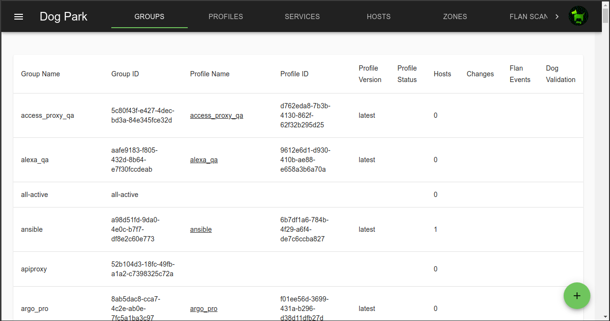
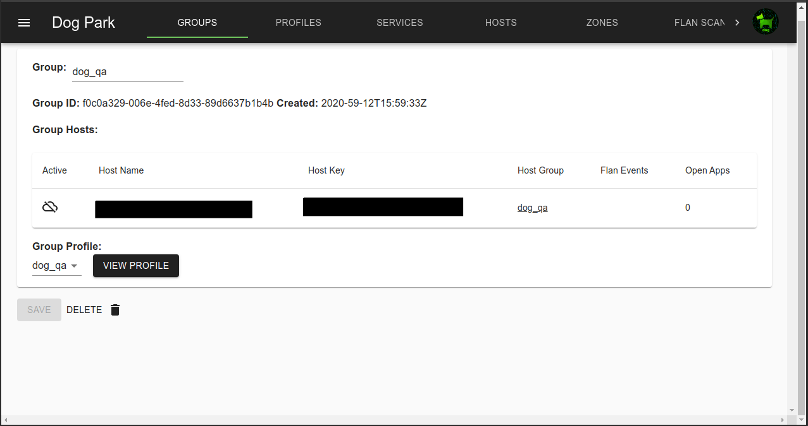

## Zones

Zones are static lists of IPs that can be referenced in Profiles.\
Fairly static Zones can be updated in the console, but highly dynamic Zones like block or allow lists can be modified via the dog_trainer API.

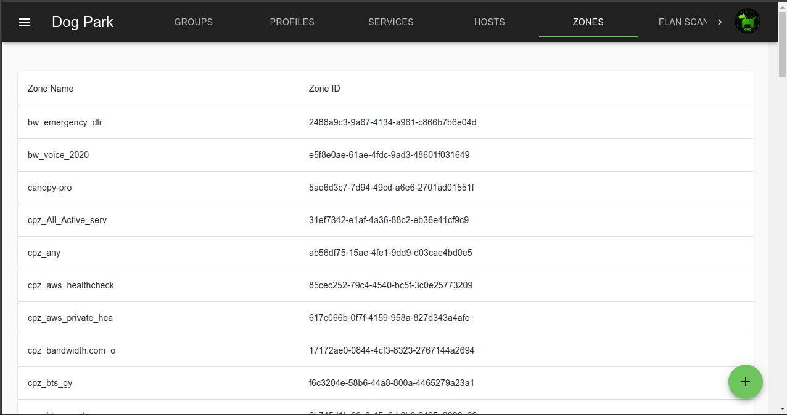
Zones can include both IPv4 and IPv6 addresses.
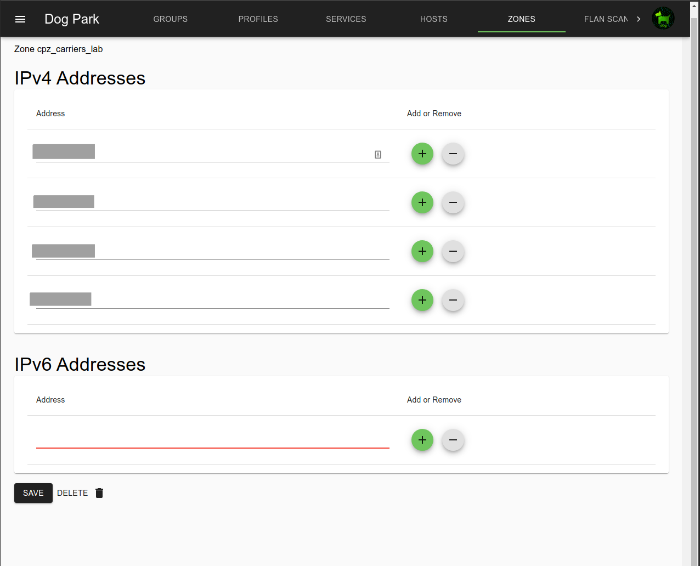

## Profiles

Profiles describe the access rules.

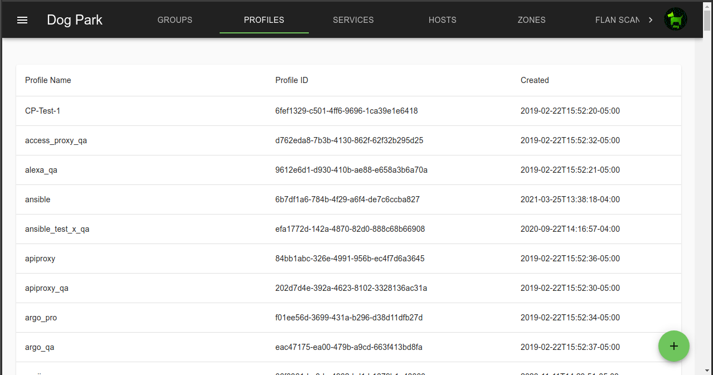

Group are associated with a Profile. Groups, Zones and Services are references in Profile rules.

Each rule can be active or inactive.

Rule types include: basic, connlimit (connection limit), recent (rate limit)

Source can be a Group or Zone.

Inbound tables are default DROP, so anything not specifically allowed by rules will be dropped.

Outbound tables are default ACCEPT.

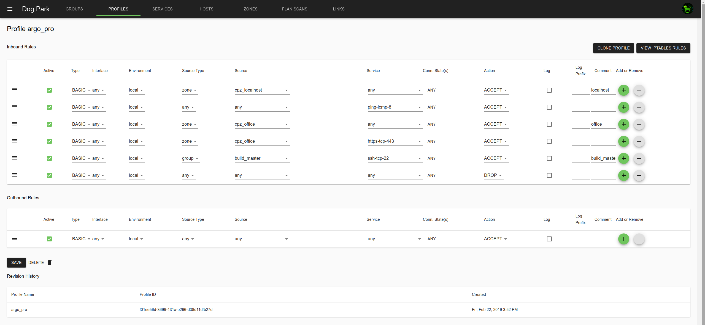

## Services

Ports and protocols are defines in Services.
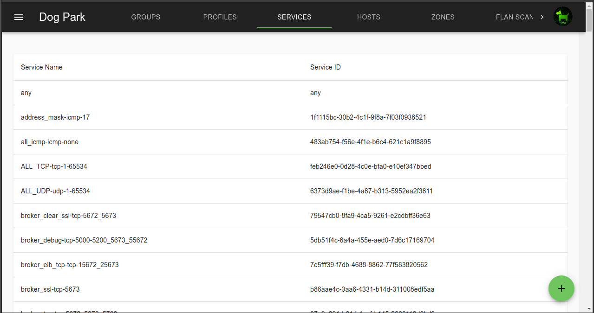
Multiple ports, each with a different protocol types can be defined per service

Ports are delimited with commas

A range of ports is indicated with a ":" between start and end.
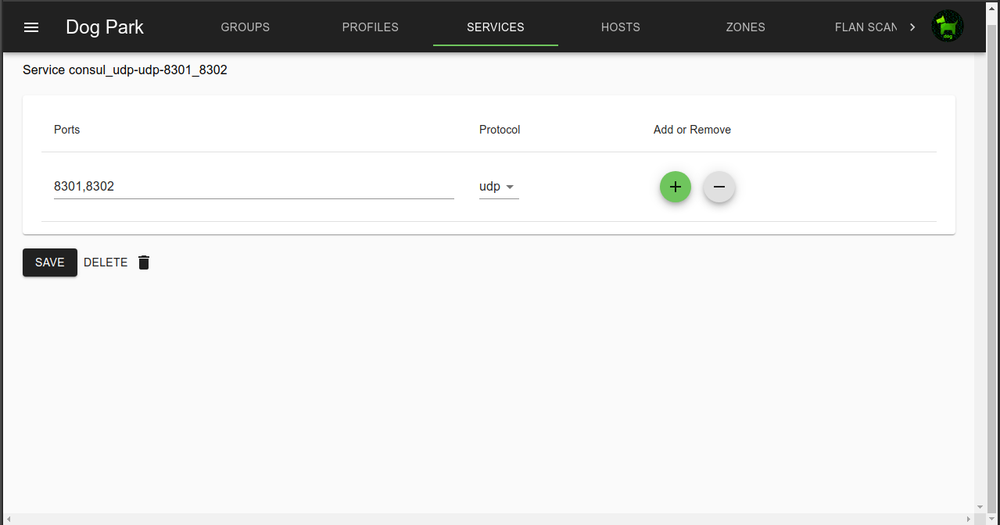

## Flan Scans

Integration with the network vulnerability scanner [Flan Scan](https://github.com/cloudflare/flan) is available.
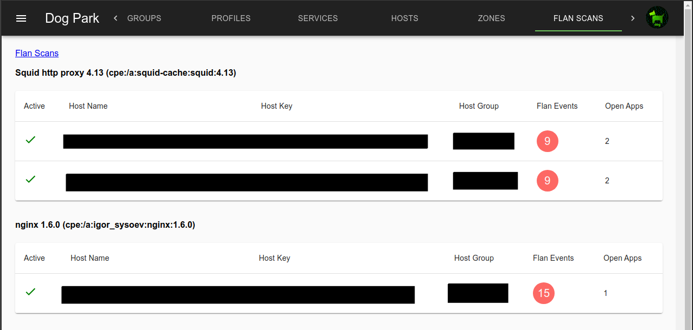
An example of a Host with a Flan Scan discovered CVE.

## External Links

Links are the way to federate multiple dog_trainer instances.  

Linked dog_trainers share Groups, Zones and Host addresses between dog_trainers, but not Profiles.

This is useful for sharing access between servers managed by different business units.

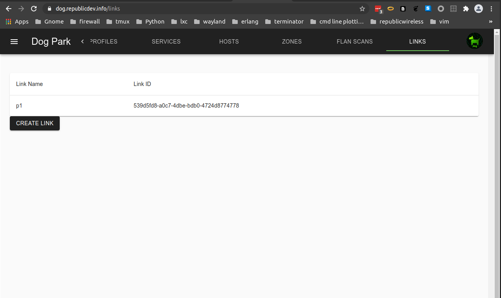

Direction can be bidirectional, inbound, or outbound.

- Bidirectional both sends and accepts addresses.
- Inbound only accepts addresses.
- Outbound only sends addresses.

Address Handling can be set to either Union or Prefix.

- Union combines each dog_trainer's host and zone addresses with
the same name into the same ipset.  

    simplified example: A group called "web" in the "q1" and "p1" environments that
have a Union link will combine the addresses of all Hosts in that group into a
single ipset called "web" both environments.

    This is useful for splitting a single environment up into multiple dog_trainers,
for example between QA and Production environments.

- Prefix creates unique ipsets for each host and zone in each environemt,
adding the the two character link prefix to the ipset names to ensure they are unique.

    simplified example: A group called "web" in the "q1" and "p1" environments
that have a Prefix link will create two ipsets in each environment, one called "q1_web"
and the other called "p1_web".

Connection information is for the other sides' RabbitMQ.
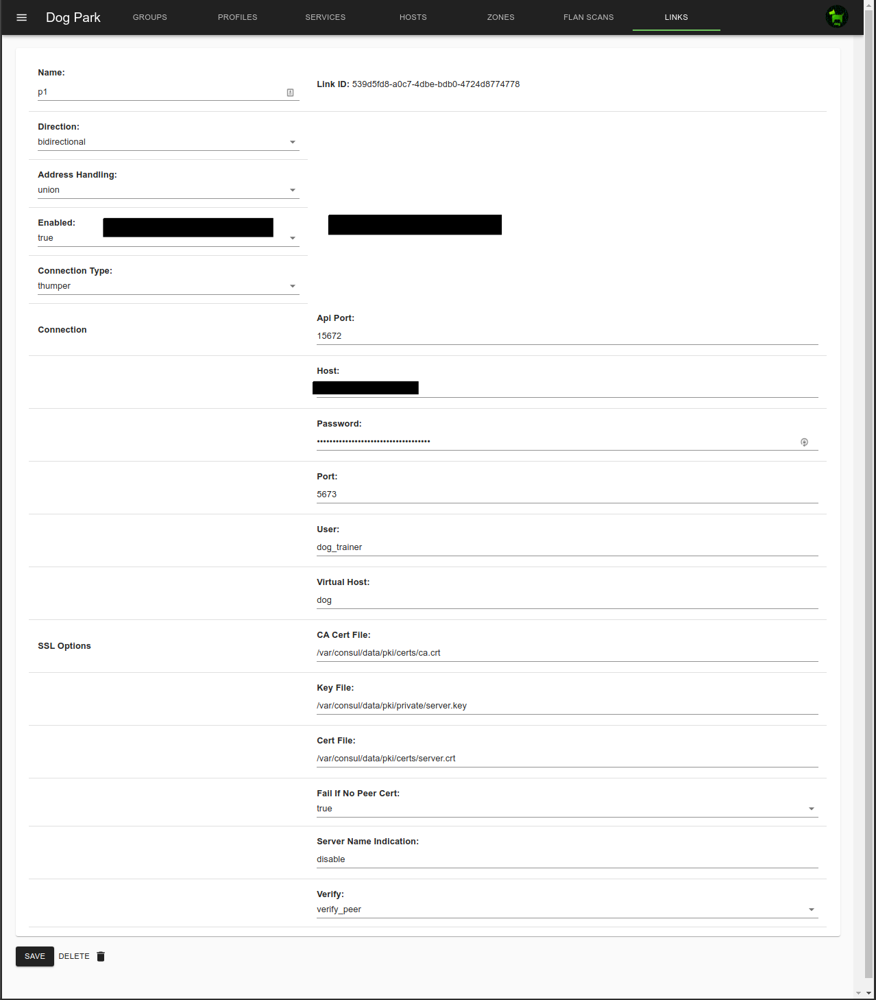
